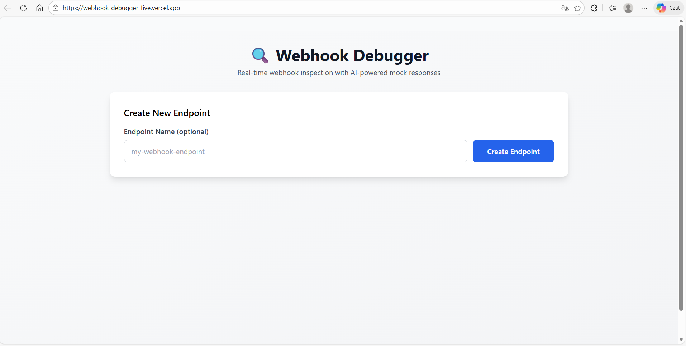
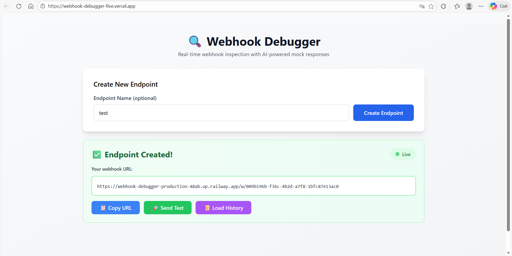
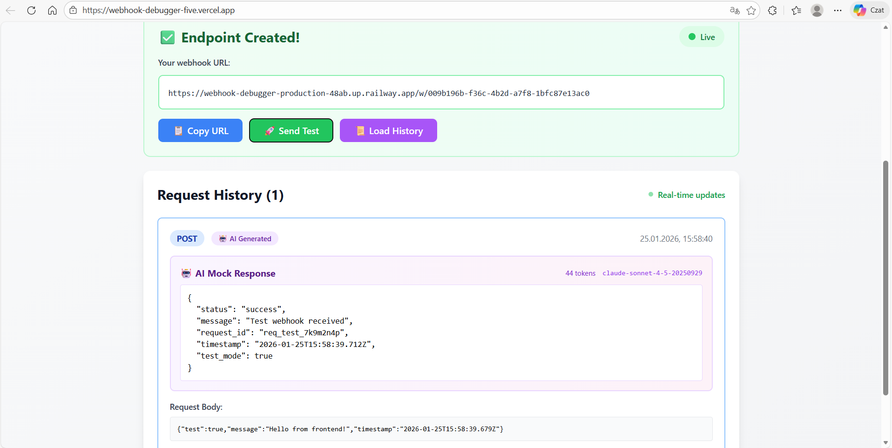

# 🔍 Webhook Debugger

<div align="center">


**Real-time webhook inspection and testing tool with AI-powered mock responses**

[🚀 Live Demo](https://webhook-debugger-five.vercel.app) • [📖 Installation](#-installation) • [🐛 Report Bug](https://github.com/michal-jonczyk/webhook-debugger/issues)

</div>

---

## 📸 Screenshots

### Create Endpoint


### Endpoint Created with Live WebSocket Connection


### AI-Powered Mock Response


> **💡 Try it live:** [webhook-debugger-five.vercel.app](https://webhook-debugger-five.vercel.app)

---

## 🎯 What Problem Does This Solve?

Testing webhooks during development is painful:
- ❌ Need to deploy code just to test
- ❌ Can't see webhook payloads in real-time
- ❌ Hard to simulate realistic responses

**Webhook Debugger fixes this:**
- ✅ Instant webhook URLs (no deployment)
- ✅ Real-time request inspection via WebSockets
- ✅ AI generates intelligent mock responses automatically

---

## ✨ Key Features

### 🔗 Instant Webhook Endpoints
Generate unique URLs in seconds - no configuration needed.

```bash
POST /endpoints
→ Returns: https://webhook-debugger-production-48ab.up.railway.app/w/abc-123
```

### ⚡ Real-time WebSocket Updates
See incoming webhooks **instantly** without refreshing:
- Live connection indicator
- Automatic request notifications
- Zero polling overhead

### 🤖 AI-Powered Mock Responses
Uses **Anthropic Claude Sonnet 4** to generate contextual responses:

```json
// Your webhook:
{"event": "payment.success", "amount": 100}

// AI generates:
{
  "status": "success",
  "transaction_id": "tx_abc123",
  "amount": 100.00,
  "currency": "USD",
  "message": "Payment processed successfully"
}
```

### 🛡️ Built-in Rate Limiting
- 10 AI calls per endpoint per hour
- 20 AI calls per IP per hour
- Automatic cost tracking

### 📊 Request History
- View all captured webhooks
- Inspect headers, body, metadata
- Copy and replay requests

---

## 🛠️ Tech Stack

**Backend:**
- **FastAPI** - Modern async Python framework
- **WebSockets** - Real-time bidirectional communication
- **Anthropic Claude API** - AI response generation
- **Pydantic** - Data validation
- **Railway** - Backend deployment

**Frontend:**
- **React 19** - UI library with hooks
- **Tailwind CSS** - Utility-first styling
- **WebSocket API** - Native browser WebSocket
- **Vite** - Fast build tool
- **Vercel** - Frontend deployment

---

## ⚡ Installation

### Prerequisites

```bash
# Python 3.11+ required
python --version

# Node.js 20+ for frontend
node --version
```

### 🔧 Backend Setup

```bash
# 1. Clone repository
git clone https://github.com/michal-jonczyk/webhook-debugger.git
cd webhook-debugger/backend

# 2. Create virtual environment
python -m venv venv

# Activate (Windows)
venv\Scripts\activate

# Activate (Linux/Mac)
source venv/bin/activate

# 3. Install dependencies
pip install -r requirements.txt

# 4. Configure environment
cd app
copy .env.example .env

# 5. Edit .env and add your API key
# Get free key: https://console.anthropic.com/settings/keys
notepad .env  # Windows
nano .env     # Linux/Mac
```

**Your `.env` should contain:**
```bash
ANTHROPIC_API_KEY=sk-ant-api03-xxxxx  # Your real key
AI_ENABLED=True
BASE_URL=http://localhost:8000
ALLOWED_ORIGINS=http://localhost:5173
```

```bash
# 6. Run backend
uvicorn main:app --reload

# ✅ Backend: http://localhost:8000
# 📖 API docs: http://localhost:8000/docs
```

### 🎨 Frontend Setup

```bash
# New terminal
cd webhook-debugger/frontend

# 1. Install dependencies
npm install

# 2. Run dev server
npm run dev

# ✅ Frontend: http://localhost:5173
```

### 🧪 Test the Setup

```bash
# Create endpoint
curl -X POST http://localhost:8000/endpoints \
  -H "Content-Type: application/json" \
  -d '{"name": "test"}'

# Send test webhook
curl -X POST http://localhost:8000/w/YOUR_ENDPOINT_ID \
  -H "Content-Type: application/json" \
  -d '{"test": "hello"}'
```

---

## 🏗️ Project Architecture

```
webhook-debugger/
├── backend/
│   └── app/
│       ├── api/
│       │   ├── routes/
│       │   │   ├── endpoints.py    # Endpoint CRUD
│       │   │   └── webhooks.py     # Webhook receiver
│       │   └── main.py            # FastAPI + WebSocket
│       │
│       ├── services/
│       │   ├── endpoint_service.py
│       │   └── ai_service.py       # Claude integration
│       │
│       ├── middleware/
│       │   ├── rate_limiter.py     # Token bucket
│       │   └── usage_tracker.py    # Cost tracking
│       │
│       ├── storage/
│       │   └── store.py            # In-memory store
│       │
│       └── schemas/
│           └── endpoint.py         # Pydantic models
│
└── frontend/
    └── src/
        ├── components/
        │   └── CreateEndpoint.jsx
        └── App.jsx
```

### 🔄 Request Flow

```
1. User creates endpoint
   → POST /endpoints
   → Generates unique ID
   → Stores in memory

2. User sends webhook
   → POST /w/{endpoint_id}
   → Validates endpoint exists

3. Backend processing
   → Saves request
   → Calls Claude API
   → Applies rate limiting

4. Real-time broadcast
   → WebSocket event to clients
   → Frontend updates instantly
```

---

## 💡 What I Learned

### Technical Challenges Solved

#### 1️⃣ WebSocket State Management in React

**Problem:** WebSocket connections lost on re-renders, causing memory leaks.

**Solution:** Used `useRef` to persist connection + proper cleanup:

```javascript
const wsRef = useRef(null)

useEffect(() => {
  const ws = new WebSocket(url)
  wsRef.current = ws
  
  return () => {
    if (ws.readyState === WebSocket.OPEN) {
      ws.close()
    }
  }
}, [endpoint])  // Only reconnect when endpoint changes
```

**Key Takeaway:** React's render cycle requires careful handling of external connections.

---

#### 2️⃣ Rate Limiting Without Database

**Problem:** Prevent AI API abuse without adding Redis/PostgreSQL.

**Solution:** In-memory sliding window algorithm:

```python
class RateLimiter:
    def __init__(self):
        self.calls = defaultdict(list)
    
    def check_limit(self, key, max_calls=10, window=60):
        now = datetime.now()
        # Remove expired timestamps
        self.calls[key] = [t for t in self.calls[key] 
                          if t > now - timedelta(minutes=window)]
        return len(self.calls[key]) < max_calls
```

**Key Takeaway:** Simple in-memory solutions work great for non-critical data.

---

#### 3️⃣ CORS + WebSocket on Railway

**Problem:** WebSocket worked locally but failed in production with CORS errors.

**Solution:**
- Configure `ALLOWED_ORIGINS` in environment
- Use `wss://` (secure WebSocket) in production
- Auto-detect protocol:

```javascript
const API_URL = 'https://api.example.com'
const wsUrl = API_URL.replace('https://', 'wss://').replace('http://', 'ws://')
```

**Key Takeaway:** Deployment exposes issues localhost doesn't (SSL, CORS, env vars).

---

#### 4️⃣ AI Response Parsing

**Problem:** Claude sometimes returns JSON wrapped in markdown (` ```json ... ``` `).

**Solution:** Robust parsing with fallback:

```python
def extract_json(text: str):
    text = text.strip()
    # Strip markdown fences
    if text.startswith("```json"):
        text = text[7:]
    if text.endswith("```"):
        text = text[:-3]
    
    try:
        return json.loads(text.strip())
    except JSONDecodeError:
        return {"message": text, "raw": True}
```

**Key Takeaway:** Always handle unexpected formats gracefully with third-party APIs.

---

### Skills Developed

- ✅ **Real-time Communication:** WebSockets, connection management, state sync
- ✅ **API Design:** REST endpoints, WebSocket protocols, error handling
- ✅ **Rate Limiting:** Sliding window, cost tracking, abuse prevention
- ✅ **AI Integration:** Prompt engineering, response parsing, token management
- ✅ **React Hooks:** useEffect, useRef, useState for complex state
- ✅ **Deployment:** Environment variables, CORS, SSL/WSS, Railway + Vercel

---

## 🔮 Future Improvements

### Planned Features
- [ ] **Persistent Storage:** PostgreSQL + Redis for production
- [ ] **Request Replay:** Re-send captured webhooks with modifications
- [ ] **Custom Templates:** User-defined response structures
- [ ] **Webhook Signatures:** HMAC validation (GitHub/Stripe style)
- [ ] **Export Data:** Download history as JSON/CSV
- [ ] **Request Filtering:** Search by method, headers, body

### Nice to Have
- [ ] **Collaboration:** Share endpoints with team
- [ ] **Request Diffing:** Compare multiple webhooks
- [ ] **Scheduled Webhooks:** Send at specific times
- [ ] **Docker Support:** Easy local setup

> 💭 **Note:** This is a learning/portfolio project. These features would make it production-ready.

---

## 🚀 Deployment

### Backend (Railway)

1. Create account at [Railway.app](https://railway.app)
2. Connect GitHub repository
3. Set environment variables:
   ```
   ANTHROPIC_API_KEY=your_key
   AI_ENABLED=True
   BASE_URL=https://your-app.railway.app
   ALLOWED_ORIGINS=https://your-frontend.vercel.app
   ```
4. Deploy from `main` branch

### Frontend (Vercel)

1. Update `API_URL` in `CreateEndpoint.jsx`:
   ```javascript
   const API_URL = 'https://webhook-debugger-production-48ab.up.railway.app'
   ```
2. Deploy to Vercel:
   ```bash
   npm run build
   vercel --prod
   ```

---

## 📄 License

MIT License - see [LICENSE](LICENSE) file

---

## 🤝 Contributing

This is a portfolio project, but suggestions welcome!

1. Fork the repository
2. Create feature branch (`git checkout -b feature/amazing`)
3. Commit changes (`git commit -m 'Add feature'`)
4. Push (`git push origin feature/amazing`)
5. Open Pull Request

---

## 👨‍💻 Author

**Michał Jończyk**

- GitHub: [@michal-jonczyk](https://github.com/michal-jonczyk)

---

## 🙏 Acknowledgments

- [Anthropic](https://anthropic.com) - Claude AI API
- [FastAPI](https://fastapi.tiangolo.com) - Modern Python framework
- [Railway](https://railway.app) - Simple deployment

---

<div align="center">


[🚀 Live Demo](https://webhook-debugger-five.vercel.app)

</div>
